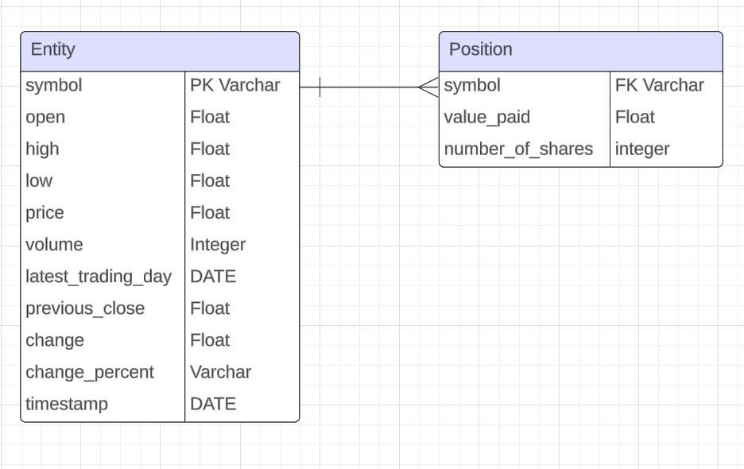

# Java Stock Quote App

# Introduction
The Java stock quote application is an application that will allow a user to search and save the information of stocks from a backend API into a Postgres database. The user can than utilize this saved stock quote data in order to fulfill purchase and sell position orders similar to a live stock exchange. This application was implemented using Java and its respective SQL libraries. Maven was used to build and package the application into a jar. The application was dockerized and hosted on docker hub for use by end users.

# Implementation
The Java stock quote application was designed using Java 11. A quote class was created to have quote objects containing the necessary stock information. A position class was also created to host any information regarding the position you had purchased on the exchange. Stock information was fetched from Alpha Vantage API as to ensure the stock's quote accuracy. HttpRequest was used to fetch this data into a JSON format. The JSON format was then parsed and inserted into the database using the quote DAO. Multiple DAO files were created in order to handle the application logic with encapsulation. Service files were created to pre-process before allowing processing with the DAO. Controllers were created for saving, finding, and deleting the data from stocks and positions. Maven was used to handle dependencies and package the project. Docker was used to dockerize the application for portability.

## ER Diagram

## Design Patterns
The stock quote application uses the service layer architecture containing the following: Entity, DAO, and service layer. A controller layer is used as an interface for the end user.

The entity layer contains classes for quote and position. It contains getters, setter and relevant information pertaining both classes.

The DAO layer contains methods to access/manipulate the data found in the database. It has a variety CRUD methods that are applicable to both the quotes and positiosn. The DAO includes methods for saving quote/position information, retrieving quotes/positions using a specific ticker, retrieving all quotes/positions, deleting quotes/positions using a specific ticker, and deleting all quotes/positions.

The service layer facilitates the communication between the user controller and DAO layer. It includes methods such as purchasing/selling stocks as well as saving stock information.

The controller layer allows for the user to input commands and to receive outputs from the service and DAO layer. It includes a terminal interface for interacting with the stock quotes as well as positions in stocks.

# Test
Testing was performed for this project by using JUnit for unit testing and Mockito for integration testing. 

Unit testing was performed on every method found in the position and quote DAO layers. Both position and quote objects were created and used to create, delete and update different database values and retrieved to see if the expected changes were met.

Integration testing was performed using Mockito by mocking the stub and DAO objects. Database, method and API calls were mocked and appropriate objects were returned. Mock injections were applied to the service layer objects.

Manual testing was performed by using the controller class to submit inputs in order to propagate changes in the database. Changes were inspected and compared to the expected values.