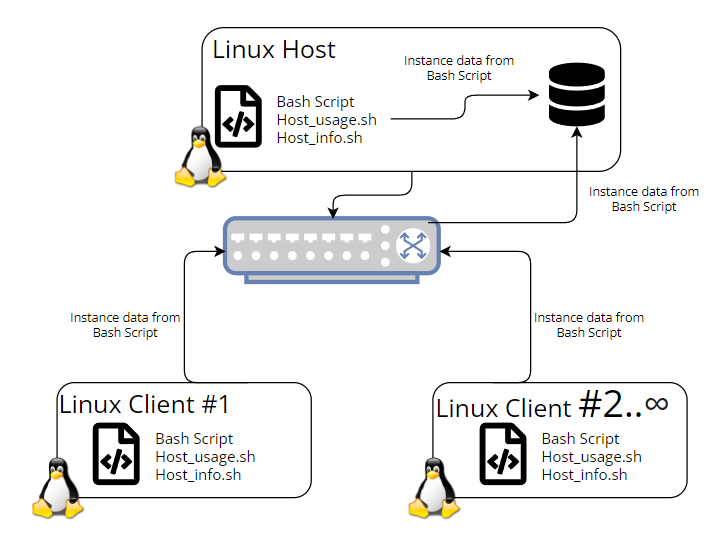

# Linux Resource Cluster Monitoring Agent

# Introduction
The Linux resource cluster monitoring agent is a minimum viable product (MVP) that will monitor the resources across a cluster environment. Many bash scripts will execute in order to perform tasks such as registering a host container's information as well as updating a host container's usage in realtime. The users of this program will be the Linux Cluster Administration team (LCA). The LCA will use this program to monitor the nodes in our Linux cluster and collect information to make load/storage balancing decisions. Technologies that are explored in this program include Git (Version Control), Linux bash script, docker (hosting and containerizing database), and PostgreSQL (storing and querying data).

# Quick Start
1. Start a psql instance using psql_docker.sh

      How do we create a psql instance if we do not have one?
      ``` bash
     ./scripts/psql_docker.sh create [username] [password]
      ```
      If a psql docker instance has been created, start/stop the instance using the following command:
     ``` bash
     ./scripts/psql_docker.sh (start | stop)
     ```
2. Create host_info and host_usage table in DB using ddl.sql bash script
     ``` bash
     psql -h localhost -U postgres -p 5432 -d host_agent -f sql/ddl.sql
     ```
3. Insert hardware specs data into the DB using host_info.sh bash script
    ``` bash
     ./scripts/host_info.sh psql_host psql_port db_name psql_user psql_password
    ```
4. Insert hardware usage data into the DB using host_usage.sh bash script
   ``` bash
    ./scripts/host_usage.sh psql_host psql_port db_name psql_user psql_password
   ```
5. Setup Crontab to periodically collect hardware usage data for current psql instance in one minute intervals

      Create a crontab job using the following command:
      ``` bash
     crontab -e
      ```
      Edit the crontab job and insert the following command:
     ``` bash
     * * * * * bash /home/centos/dev/jrvs/bootcamp/linux_sql/host_agent/scripts/host_usage.sh
     ```
      How do we stop the crontab job?
      >Stop the crontab job by editting and removing the job or stopping the crond service
# Implementation
The Linux resource cluster monitoring agent program was created through containerizing a psql instance using docker. Bash scripts we're built to provide the psql instance in the container with functionalities. Once the container was running, ddl.sql was utilized for table creation (host_info and host_usage). The host's hardware information was inserted into the DB by running the host_info.sh script. The host's resource usage was inserted and stored as well by running the host_usage.sh script. In order to automate collecting the host's resource usage, a crontab job was created to run at minute intervals running the host_usage.sh script. This allowed for realtime population and updates of our psql instance.
# Architecture

