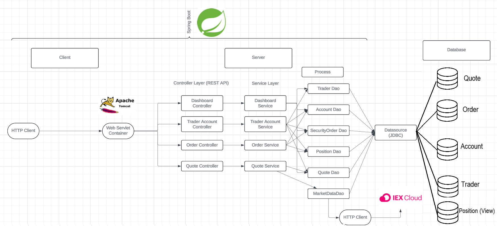
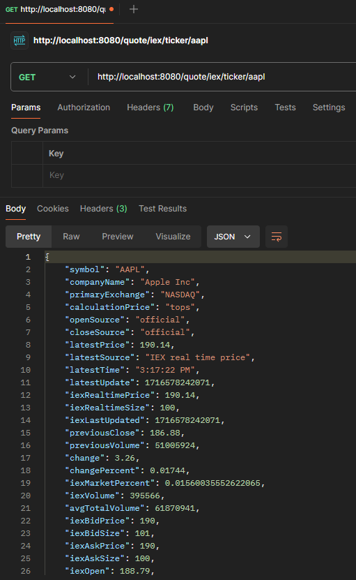
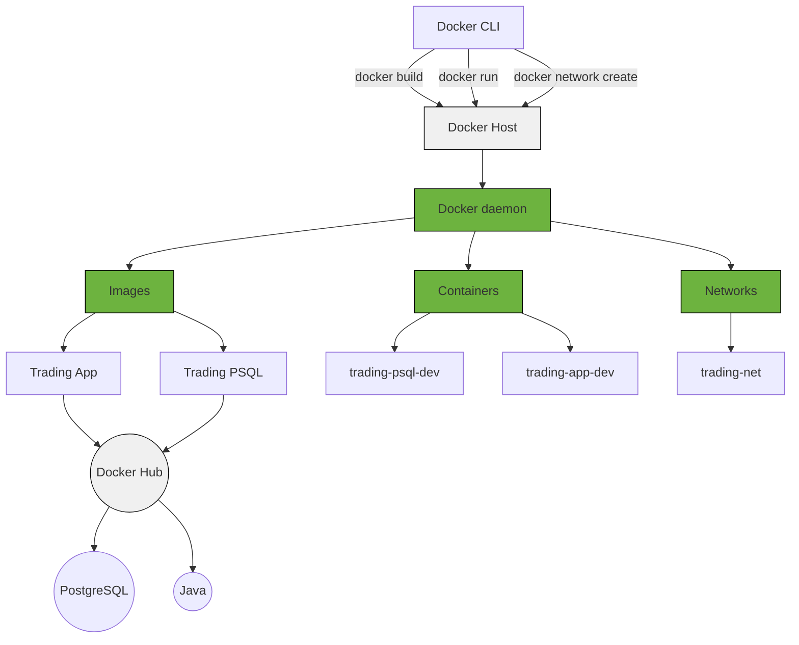

# Introduction
The Jarvis Spring Boot Trading application was designed in order to create a scale-able stock exchange. The trading application contains features such as
saving quote information, purchasing/selling quotes, having mock bank accounts to track finances and a watch list to track quotes. 
# Quick Start
- Prequiresites: Docker, CentOS 7
- Docker Setup
    - Pull application and database docker images
    - Connect both docker images under a docker network
    - Begin containers using docker start 'containerName'
- Try trading-app with postman UI using correct end points and body data
- Verify Database connectivity using DBeaver/PGAdmin4

# Implemenation
The backend api was developed with springboot while leveraging the n-layered architecture. The layers consisted of creating entities mapped to the database tables, dao's for handling data logic, service layer for method abstraction and the controller layer for communicating between the view and model. 
The application is deployed with a docker container communicating with each other on a docker
network. One of the containers are responsible for application logic. The second container is responsible for storing the financial data in a postgres database hosted on the container.

## Architecture
- Application N-Layered Architecture
    - Controller layer (Handles user requests using REST APIs. Requests are routed to the appropriate processing logic. Controller returns a response with a JSON payload back to client.)
      - DashboardController
      - TraderAccountController
      - OrderController
      - QuoteController
    - Service layer (Handles business logic and performs operations on data received from controllers. It allows us to call methods that are required when triggered by the controller.)
      - DashboardService
      - TraderAccount Service
      - OrderService
      - QuoteService
    - DAO layer (Allows client to perform CRUD operations on data in the postgres database. Handles database queries, inserts, updates and deletes.)
    - SpringBoot: webservlet/TomCat and IoC
    - PSQL (storing data for quotes)
    - IEX (Retrieving real-time quote data)
## Schema

## REST API Usage
### POSTMAN
Postman is an easy-to-use API development tool that allows for sending HTTP requests ot test, develop and document APIs. Users can send HTTP methods followed by required headers, parameters and body payloads. 
Developers benefit heavily from postman as they are able to see the responses their API calls can make. It can be used to execute tests to ensure the reliability of our APIs in a production environment.
### Quote Controller
- Handles and manages the endpoints related to handling stock quotes
- Contains methods to retrieve, create and update quotes
- Interacts with Quote Service in order to perform business logic
  - GET /quote/iex/ticker/{ticker}: Retrieves an IEX quote for a given ticker symbol.
  - PUT /quote/iexMarketData: Updates market data for saved quotes.
  - POST /quote/tickerId/{tickerId}: Creates a quote for a given ticker ID.
  - GET /quote/dailyList: Retrieves a list of all quotes.
  - PUT /quote/: Updates a quote provided the appropriate RequestBody in the format of a Quote object.
- High-level description for trader controller (e.g. it can manage trader and account information. it can deposit and withdraw fund from a given account)
### Trader Controller
- Manages trader and account information
- Includes methods to create and delete traders and handling of funds (withdrawing & depositing)
- Interacts with Trader Account Service in order to perform business logic
  - POST /trader/firstname/{firstname}/lastname/{lastname}/dob/{dob}/country/{country}/email/{email}: Creates a new trader and an associated account. It takes various path variables such as first name, last name, date of birth, country, and email to create the trader.
  - POST /trader/: Creates a new trader and an associated account using a DTO (Data Transfer Object) provided the appropriate RequestBody in the format of a trader object.
  - DELETE /trader/traderId/{traderId}: Deletes a trader and its associated account if the account has a zero balance and no open positions.
  - PUT /trader/deposit/traderId/{traderId}/amount/{amount}: Deposits funds into the account associated with the given trader ID.
  - PUT /trader/withdraw/traderId/{traderId}/amount/{amount}: Withdraws funds from the account associated with the given trader ID.
# Test
- Unit testing was performed in order to check coverage using JUnit
- Test Configuration file was created to create beans for test environment
- Utilized postman in order to send HTTP methods with correct body arguments and retrieved correct responses
- Verified any CRUD operations on test database
## Sample Test

# Deployment

- Docker images pulled and built for trading-psql-dev and trading-app-dev from docker cloud
- Docker images are run using docker run imageName command-line argument
- Docker network created in order to allow communication between both containers
- Make sure to test if connection is present using DBeaver/PGAdmin4

# Improvements
- Front end interface that can compile request body and communicate with api endpoints without having to format requests
- Hosting database on the cloud for security and reliability
- Employing kubernetes to manage the containers for efficiently
